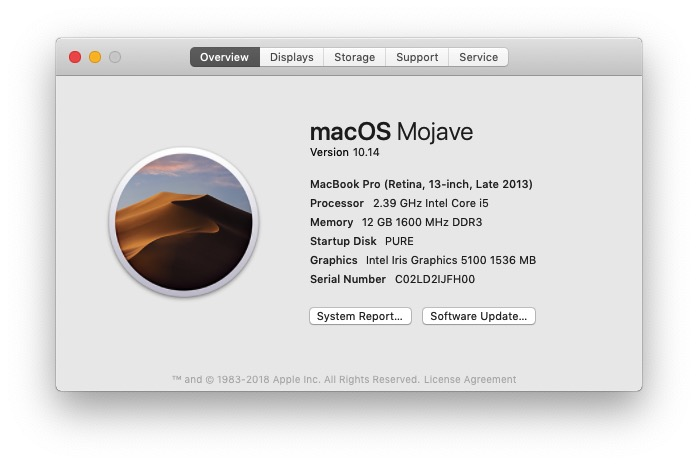

# My working OS is macOS 10.14 (ASM)

# After i encount a compile ERROR ... I start usring openSUSE ... (C)

# Thanks for this wanderful tutorial
[os-tutorial](https://github.com/cfenollosa/os-tutorial)

# Some compile problem

[GCC 8.2.0 compile error](https://gcc.gnu.org/bugzilla/show_bug.cgi?id=86724)

[macOS 10.14 no /usr/includes](https://forums.developer.apple.com/thread/104296)

No, there is a gcc compile *ERROR* that I cannot solve .... SO Eventualy I change my working  OS to openSUSE Leap ...
